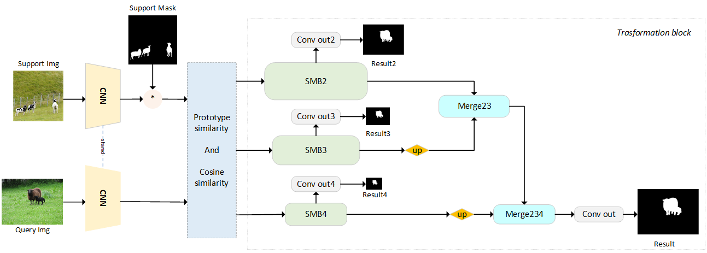
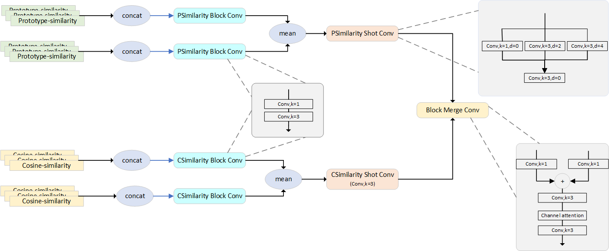
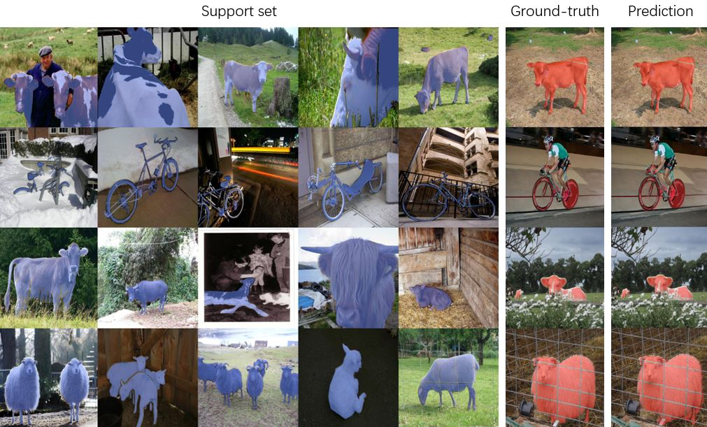

# Multi-Simlarity Based Hyperrelation Network for Few-Shot Segmentation

This is the implementation of the paper "Multi-Simlarity Based Hyperrealation Network for Few-Shot Segmentation for Few-Shot Segmentation". 

Implemented on Python 3.7 and Pytorch 1.8.
The main structure of the network is as follows:
<p align="middle">
    
</p>

The following figure shows our proposed Symmetric Merging Block (SMB):
<p align="middle">
    
</p>

## Requirements

- Python 3.7
- PyTorch 1.8
- cuda 11.1
- opencv 4.3
- tensorboard 1.14

## Preparing Few-Shot Segmentation Datasets
Download following datasets:

> #### 1. PASCAL-5<sup>i</sup>
> Download PASCAL VOC2012 devkit (train/val data):
> ```bash
> wget http://host.robots.ox.ac.uk/pascal/VOC/voc2012/VOCtrainval_11-May-2012.tar
> ```
> Download PASCAL VOC2012 SDS extended mask annotations from [[Google Drive](https://drive.google.com/file/d/10zxG2VExoEZUeyQl_uXga2OWHjGeZaf2/view?usp=sharing)]. It was created by Juhong Min et al.

> #### 2. COCO-20<sup>i</sup>
> Download COCO2014 train/val images and annotations: 
> ```bash
> wget http://images.cocodataset.org/zips/train2014.zip
> wget http://images.cocodataset.org/zips/val2014.zip
> wget http://images.cocodataset.org/annotations/annotations_trainval2014.zip
> ```

The Dataset directory is the folder where you put the Dataset. The Dataset directory structure is as follows:

    ── Dataset/
        ├── VOC2012/            # PASCAL VOC2012 devkit
        │   ├── Annotations/
        │   ├── ImageSets/
        │   ├── ...
        │   └── SegmentationClassAug/
        ├── COCO2014/           
           ├── annotations/
           │   └── ..some json files..
           ├── train2014/
           └── val2014/


## Training
> ### 1. PASCAL-5<sup>i</sup>
>Set parameters in file train.py and run the following command:
>`python train.py`

> ### 2. COCO-20<sup>i</sup>
>Set parameters in file train.py and run the following command:
> `python train_coco.py`


## Testing

> Pretrained models are available on our [[Baidu Netdisk](https://pan.baidu.com/s/1nUUpWlRUaJ9Kq95M18DipA?pwd=gjpt)].

>Set the parameters in test.py and execute:
> `python test.py`

## Visualization

* To visualize mask predictions, add command line argument **--visualize**:
  (prediction results will be saved under vis/ directory)
```bash 
  python test.py '...other arguments...' --visualize  
```
## Single Similarity
To train and test for single similarity, change the mshnet in F file to mshtnet_cor or mshnet_pt
#### Example qualitative results (5-shot and 1-shot):

<p align="middle">
    
</p>
   
## Acknowledgment
Thanks to Juhong Min, Dahyun Kang and Minsu Ch for their contributions, much of our code is based on their shared [HSNet](https://github.com/juhongm999/hsnet).
## BibTeX
If you use this code for your research, please consider citing:
````BibTeX
@InProceedings{
    title={Multi-Simlarity Based Hyperrelation Network for Few-Shot Segmentation},
    author={Xiangwen Shi, Shaobing Zhang, Miao Cheng, Lian He, Zhe Cui, Xianghong Tang},
}
````
